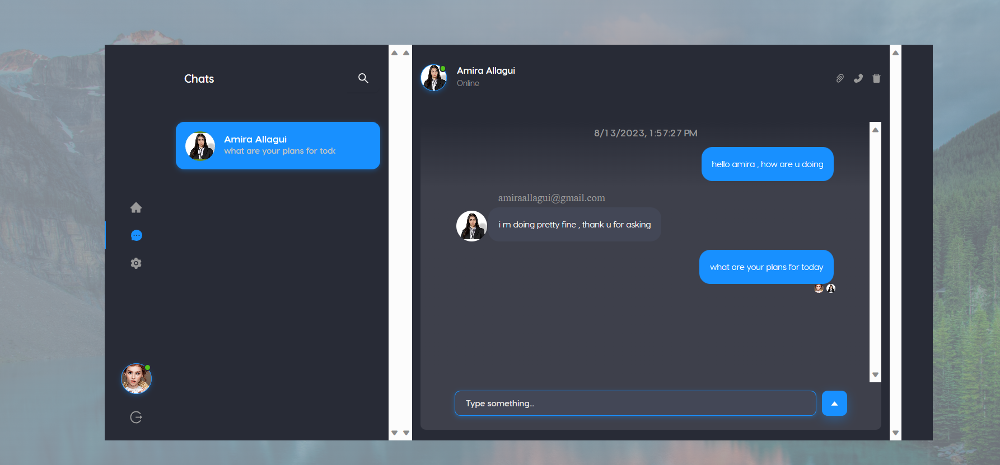

# 🌐 TypeScript Chat App with ChatEngine
This is a real-time chat application built using TypeScript and ChatEngine. The app enables users to engage in dynamic conversations in real-time, with features such as user authentication and message history.

## Live demo
https://amiraallagui.github.io/typescript-chat-app/



## Features

- 💬 Real-time messaging powered by ChatEngine.
- 🔐 User authentication for secure and personalized interactions.
- 🚀 Dynamic chat rooms for engaging conversations.
- 📜 Message history to access previous messages.
- 📬 Real-time notifications for new messages.
- 🌐 User presence status (online/offline).
- 🔒 Enhanced security measures for data protection.


## Dependencies

- TypeScript
- ChatEngine
- React (or your preferred frontend library)


## Contributing

Contributions are welcome! If you find any bugs or want to suggest improvements, please submit an issue or a pull request.


For more information, please refer to the [ChatEngine documentation](https://chatengine.io/docs/) and the [TypeScript documentation](https://www.typescriptlang.org/docs/).

Happy chatting! 🚀

## Setup

Go to [chatengine.io](https://chatengine.io) and create your own project. There you will get a Project ID and Private Key which are needed for user signup and authentication.

### `.env.local`

Create a `.env.local` file at the top-level of your project, and replace the UUIDs with your own Project ID and Private Key from [chatengine.io](https://chatengine.io).

```
REACT_APP_PROJECT_ID=12341234-1234-1234-1234-123412341234
REACT_APP_PROJECT_KEY=abcdabcd-abcd-abcd-abcd-abcdabcdabcd
```

This will link your new React App to the right Chat Engine project.

### `npm install`

Build out your node modules by running `npm install`. Then you cn start the app.

### `npm run start`

This will start the app. By default it will run on [localhost:3000](http://localhost:3000/)

### `npm run build`

Builds the app for production to the `build` folder.\
It correctly bundles React in production mode and optimizes the build for the best performance.

The build is minified and the filenames include the hashes.\
Your app is ready to be deployed!


## Learn More

You can learn more in the [Create React App documentation](https://facebook.github.io/create-react-app/docs/getting-started).

To learn React, check out the [React documentation](https://reactjs.org/).
